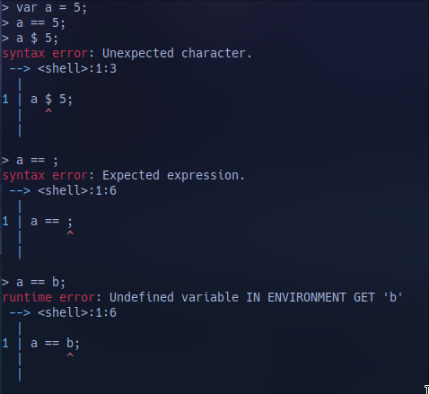

# Brakion Language
## Usage
The language interpreter lives in a Rust crate, `brakion-core`, with the interpreter and
a `Brakion` struct that can be used from outside code.

The user will mainly interact with it from the CLI using the `brakion` binary crate,
which will support operations like

- `brakion run <FILES>`: Runs the program assembled from one or several files, with
  the requirement of there only being one `main` function across them. If `FILES` is `-`, treat `stdin` as the source
- `brakion check [ARGUMENTS] <FILES>`: Checks the program up to the stage specified by arguments
  and print whatever helpful information it can gather, i.e. the token list, the AST, the namespace tree, etc.

The project is built with `cargo`, and since `brakion` is the only binary target, you can use `cargo run -- {BRAKION ARGS}`
to test it without going through `cargo build` or `cargo build --release` or `cargo install --path ./brakion`

## Testing
For unit testing, the normal Rust test system provided by `cargo` will be used and can be ran as `cargo test`.
For full end to end testing, there will be a directory of tests and their expected outputs with a simple script for
running and comparing them.

## Architecture
The language interpreter will be written in Rust. It will support running one
instance from multiple files at once, provided that only one `main` function
exists across all of them.

The repository is structured as a workspace with 2 main crates (so far):
    - `brakion`: The CLI for the interpreter
    - `brakion-core`: The library crate containing the actual interpreter.

The interpreter consists of 4 main stages:
- Lexer
- Parser
- Validator
- Runtime

The main structs in use in the interpreter are:
- `Unit`: A struct responsible for reading from a data stream of utf8 encoded text, 
  lazy loading it to memory. It grows the data buffer as it goes through in chunks
  of predefined size, holding at maximum a buffer of predefined size. Can seek to a `Span`
  for error reporting reasons.
    - `Span`: A small struct holding positional information about a token. Holds the source
      filename and start/end line, column and byte offset.
- `Lexer`: Processes a `Unit`, emitting `Token`s on demand.
    - `Token`: A token stores a `TokenKind` and optionally a `Span` of where the token exists
      in source code
    - `TokenKind`: A Rust `enum`, with variants for all types of token the language consists of,
      with extra data like the identifier, number, bool or string literal where appropriate.
- `Parser`: Processes the `Token`s created by a `Lexer` into an AST. The AST consits of 3 main
  types of nodes, all being Rust `enum`s: `Decl`, `Expr` and `Stmt`
    - `Decl`: All declarations are validated first, before the runtime runs, and stored in namespaces.
      The variants include namespaces, types, functions and traits.
    - `Stmt`: A statement is executed and does not return a value. Examples: variable declaration,
      `if` statement, `match` statement, `return`, an executable block of statements `{ ... }`
    - `Expr`: An expression is evaluated to a value at runtime. Examples: variable access, function call,
      operators, constructors.
- `Validator`: Gets the top level namespace declaration and works its way through it, interpreting
  the AST in a simplified but type-accurate manner to check for type inconsistencies, duplicate function
  names, conflicting type declarations or trait implementations, conflicting function precondition specifiers,
  etc. While traversing the declarations, also picks out the `main` function to hand it to the `Runtime`
- `Runtime`: The runtime gets the top level namespace declaration as well as the `main` function
  to execute, and executes them.
- `ErrorHandler`: Available to all the "stages" of the interpreter, gathers errors from the stages (with
  "tags" for which stage it occurred in), prints them with the aid of the `Unit` and `Span`s for
  accurate and helpful error messages, and if it gets more than zero errors in a stage, signals
  the need to ignore the further stages.
    - Example errors, taken from my earlier private programming language project. I plan to reuse
      a lot of that error handler since it produces nice errors.</br>
      


## Features
### Pass-by-reference
Variables are pass-by-reference, except for builtin arithmetic types, `bool`,
`char` and `void`

### Namespaces
Functions, types and traits are namespaced. Builtins come in the `std`
namespace. Custom namespaces in one file can be created with the `mod` keyword.
Accessing the namespaces of other files can be done by specifying the namespace 
equivalent to the filename (no extension) of another file being interpreted.

Internal namespaces shadow outside ones.

Examples:
```
mod a {
    fn x() -> void { }
}

mod b {
    mod c {
        fn y() -> i32 { 0 }
    }
}

fn main(args: [str]) -> i32 {
    a::x();
    b::c::y();
}
```

### Visibility
Namespaces, functions, types and traits can be marked with `pub` to make them
available from other files.

Methods and static methods can be marked with `pub` to make them available
outside of the type.

All fields of a type are public.

### Name shadowing
The language allows name shadowing on variables. A binding to a name that
matches a previously used name, it is replaced in the following code.

Name shadowing is not allowed on functions, classes or traits.

### Static typing
Examples:
```
var a: i32 = 5;             # Arithmetic types: i8, i16, i32, i64, u8, u16, u32, u64, f32, f64
var b: bool = false;        # Boolean type
var s: str = "abc";         # String type
var c: char = 'x';          # Character type
var x: [str] = ["a", s];    # List type
var v: void = void;         # Null/Nil type, general empty type
var u: str | i32 = 6;       # Ad-hoc union type.
```

### Operators

Supported operators in order of precedence (lowest to highest). Operators on the same level are evaluated in left-to-right order, eg `a * b / c` is `(a * b) / c`
| Operator              | Usage             | Returns                       |
|-----------------------|-------------------|-------------------------------|
| `=`                   | `a = b`           | Value of `a`                  |
| `or`                  | `a or b`          | `bool`                        |
| `and`                 | `a and b`         | `bool`                        |
| `==`, `!=`            | `a == b`, `a != b`| `bool`                        |
| `is`                  | `a is Foo::Bar`   | `bool`                        |
| `>`, `>=`, `<`, `<=`  | `a > b` etc.      | `bool`                        |
| `+`, `-`              | `a + b`, `a - b`  | Value of type of both         |
| `*`, `/`              | `a * b`, `a / b`  | Value of type of `a`          |
| `as`                  | `a as i32`        | Value of type `i32` or `void` |
| `-`, `!`              | `-a`, `!a`        | `-` type of `a`, `!` `bool`   |

### Control flow features
Examples:
```
var x: u32 = 42;
var l: [char] = ['c', 'h', 'z'];

for s in l {
    while char::from_utf8(x) != s {
        x += 1;
    }

    if x >= 255 {
        break;
    }
}
```

### Variant checking
To check a variable for its variant, one of 3 ways can be used:
    - The `is` operator
        - `a is Foo` returns a bool if it is.
    - The coalesce-access operator
        - `a?Foo.method()` calls a method on `a` only if `a` is `Foo`
        - Can be omitted if `method` has the equivalent outward-facing signature (differing only in the type of `self`) for *all* variants
    - The function argument preconditions, discussed below.

### Match
The `match` statement creates a block of `on` cases. It can optionally have a
directly named variable before the block of `on` cases to allow easy type or
value checking.
Each `on` condition can be either an expression evaluated to `bool`, an
expression evaluating to a value *other* than `bool` to be then matched against
the value of the named variable being matched, or a type/variant to be matched
against the type/variant of the named matched variable. As a result of these
requirements, `bool`-type variables cannot be matched.
An `if` should be used instead.

At the time the `match` statement is reached, all the conditions for `on` cases
are evaluated and stored. After that, each block of the matching `on` cases is
evaluated in order from top to bottom. If either of them `break`s or `return`s,
the execution of blocks is stopped and the following ones are ignored.

An `else` case can be defined as the final one. It will be executed if none of
the `on` cases match.

Examples:
```
type BinaryOperator {
    Add;
    Subtract;
    Multiply;
    Divide;
    Equal;
    NotEqual;
    Greater;
    GreaterEqual;
    Less;
    LessEqual;
    And;
    Or;

    pub fn from_str(s: str) -> Self | void {
        match s {
            on "+"      return Self::Add,
            on "-"      return Self::Subtract,
            on "*"      return Self::Multiply,
            on "/"      return Self::Divide,
            on "=="     return Self::Equal,
            on "!="     return Self::NotEqual,
            on ">"      return Self::Greater,
            on ">="     return Self::GreaterEqual,
            on "<"      return Self::Less,
            on "<="     return Self::LessEqual,
            on "and"    return Self::And,
            on "or"     return Self::Or,
            else        return Maybe::None,
        }
    }
}

type Value {
    Integer {
        value: i32,
    }
    Boolean {
        value: bool,
    }

    pub fn to_str(self) -> str {
        match self {
            on Self::Integer return self.value.to_string(),
            on Self::Boolean {
                if self.value {
                    return "true";
                }
                else {
                    return "false";
                }
            }
        }
    }
}
```

### Functions
Functions can be defined either in the top level scope, or as methods on types.
If a method has `self` as the first parameter, it can be called as a method.
Otherwise, it's treated as function in the namespace with the name of the type.

Functions cannot be overloaded, i.e. have differing signatures with the same name.
The only exception is the preconditions, explained below, which get rolled into
a single function from the programs (and interpreters!) perspective

Function parameters are typed, and additionally can have "preconditions". These
are variants of the parameters' type. The function must be defined with all
possible combinations covered, and is collapsed to a single function.
Omitting preconditions acts as a catch-all for that argument. If a conflict in
resolution is detected, it should be caught during the validation phase.

Examples:
```
type Value {
    Integer {
        value: i32,
    }
    Boolean {
        value: bool,
    }
}

type UnaryOperator {
    Negate;
    Not;
}

pub fn apply(op: UnaryOperator ? Self::Negate, value: Value ? Value::Integer) -> Value | void {
    return Value::Integer { value: -value.value };
}

pub fn apply(op: UnaryOperator ? Self::Not, value: Value ? Value::Boolean) -> Value | void {
    return Value::Boolean { value: !value.value };
}

pub fn apply(op: UnaryOperator, value: Value) -> Value | void { }
```

### Custom types
Each type is a "sum type", similar to eg. Haskell types or Rust enums.
If you want to define a type as an "atomic" type, without any variants,
it's defined by a special variant name `self` that can only be defined
if it's the only variant.

Example:
```
type Vector2 {
    self {
        x: f32,
        y: f32,
    }

    fn length(self) -> f32 {
        return std::math::sqrt(self.x * self.x + self.y * self.y);
    }
```

### Constructors
A type can be constructed by specifying all the values of its fields. For optional args, static methods on the type should be used
A field name can be omitted if the name of the variable being used to fill a field is the same as the name of the field.

Examples:
```
Value::Integer { value: 98 }
```

### Traits
Without inheritance, for sharing interfaces/code between specific types interfaces can be used.

They are implemented for each type in a separate block from its definition.

Example:
```
# Note: in the end traits like Clone will be built in to the std namespace
# That's why I'm calling clone on a string.
trait Clone {
    fn clone(self) -> Self;
}

type A {
    self {
        x: i32,
    }
}

type B {
    self {
        y: f32,
        z: str,
    }
}

impl Clone for A {
    fn clone(self) -> Self {
        return A { x };
    }
}

impl Clone for B {
    fn clone(self) -> Self {
        return B { y, z: z.clone() };
    }
}
```
# Full grammar

```
source =
    {declaration | comment}, EOF;
comment =
    "#", COMMENT, (EOL | EOF);

declaration =
    (visibility, (module | function | typeDeclaration | traitDeclaration)) | traitImplementation;
module =
    "mod", IDENTIFIER, "{", {declaration}, "}";
function =
    functionSignature, executableBlock;
typeDeclaration =
    "type", IDENTIFIER, ( typeDefinition | ";" );
traitDeclaration =
    "trait", IDENTIFIER, "{", {functionStub}, "}";
traitImplementation =
    "impl", namespacedIdentifier, "for", IDENTIFIER, "{", {function}, "}";

functionSignature =
    "fn", IDENTIFIER, "(" [functionParameters] ")", [returnType];
functionStub =
    functionSignature, ";";
functionParameters =
    (functionParameter | "self"), {",", functionParameter};
functionParameter =
    typedIdentifier, ["?", type];
typedIdentifier =
    IDENTIFIER, ":", type;
returnType =
    "->", type;

typeDefinition =
    "{", {variantDeclaration}, {function}, "}";
variantDeclaration =
    IDENTIFIER, variantDefinition;
variantDefinition =
    ";" | ("{", typedIdentifier, {"," typedIdentifier}, [","], "}");

type =
    typePrimary, {"|", typePrimary};
typePrimary =
    namespacedIdentifier | ("[", type, "]");

visibility =
    ["pub"];
executableBlock =
    "{", {statement} "}";

statement =
    varStmt | forStmt | ifStmt | returnStmt | whileStmt | matchStmt | breakStmt | continueStmt | executableBlock | assignmentOrExprStmt;

assignmentOrExprStmt =
    expression, ["=", expression], ";";
varStmt =
    "var", typedIdentifier, "=", expression, ";";
forStmt =
    "for", IDENTIFIER, "in", expression, statement;
ifStmt =
    "if", expression, statement, ["else", statement];
returnStmt =
    "return", [expression], ";";
whileStmt =
    "while", expression, statement;
matchStmt =
    "match", [IDENTIFIER], matchBody;
breakStmt =
    "break", ";";
continueStmt =
    "continue", ";";

matchBody =
    "{", {onCase}, [elseCase], "}";

onCase =
    "on", (type | expression), statement;
elseCase =
    "else", statement;

expression = logicOr;

logicOr = logicAnd, {"or", logicAnd};
logicAnd = equality, {"and", equality};
equality = typeIs, {("==" | "!="), typeIs};
typeIs = comparison, {"is", comparison};
comparison = term, {(">" | ">=" | "<" | "<="), term};
term = factor, {("-" | "+"), factor};
factor = cast, {("/" | "*"), cast};
cast = unary, {"as", type};
unary = {"!" | "-"}, primary;

arguments =
    expression, {",", expression}, [","];

call = "(", [arguments], ")";
listAccess = "[", expression, "]";
fieldAccess = ".", IDENTIFIER;

accessOrConstructorOrCallOrListAccessOrFieldAccess =
    namespacedIdentifier, [
        "->",
        "{",
        [
            fieldConstructor,
            {",", fieldConstructor},
            [","]
        ],
        "}"
    ],
    {
        call |
        listAccess |
        fieldAccess |
        coalesceAccess
    };
fieldConstructor 
    IDENTIFIER, [":", expression];
namespacedIdentifier =
    IDENTIFIER, {"::", IDENTIFIER};

listInitializer =
    "[", [expression], {",", expression}, [","], "]";

primary = ("(", expression, ")") | literal | accessOrConstructorOrCallOrListAccessOrFieldAccess;

literal =
    "true" | "false" | "void" | listInitializer |
    NUMBER | STRING | CHAR;

NUMBER =
    DIGIT_NON_ZERO, {DIGIT}, [".", DIGIT, {DIGIT}];
STRING =
    '"', {ANY_CHAR - '"' | '\"'}, '"';
CHAR =
    "'", ((ANY_CHAR - "'" - "\") | "\'" | "\n" | "\r" | "\t" | "\\"), "'";
IDENTIFIER =
    ALPHA, {ALPHA | DIGIT};
ALPHA =
      "A" | "B" | "C" | "D" | "E" | "F" | "G"
    | "H" | "I" | "J" | "K" | "L" | "M" | "N"
    | "O" | "P" | "Q" | "R" | "S" | "T" | "U"
    | "V" | "W" | "X" | "Y" | "Z"
    | "a" | "b" | "c" | "d" | "e" | "f" | "g"
    | "h" | "i" | "j" | "k" | "l" | "m" | "n"
    | "o" | "p" | "q" | "r" | "s" | "t" | "u"
    | "v" | "w" | "x" | "y" | "z";
ANY_CHAR = ? any characters ?;

DIGIT_NON_ZERO =
    "1" | "2" | "3" | "4" | "5" |
    "6" | "7" | "8" | "9";
DIGIT = "0" | DIGIT_NON_ZERO;
```
